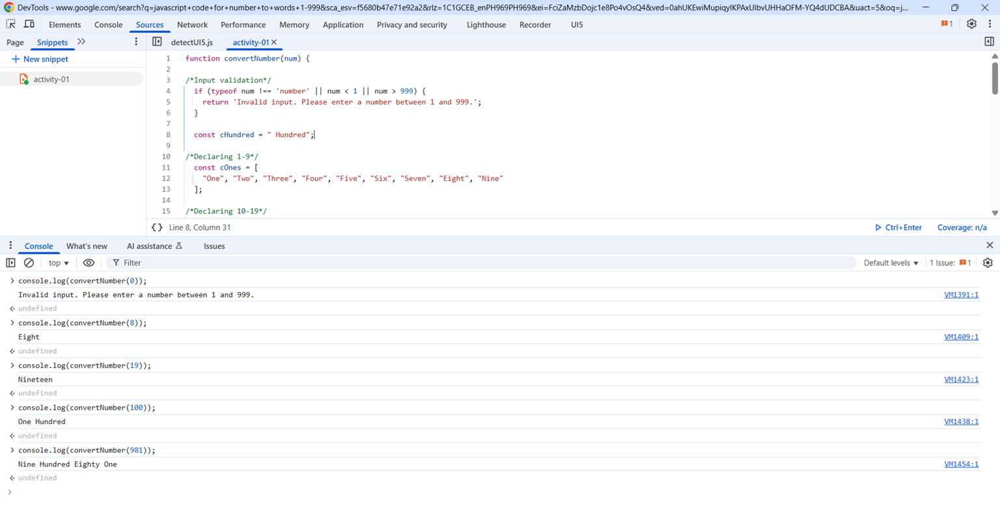
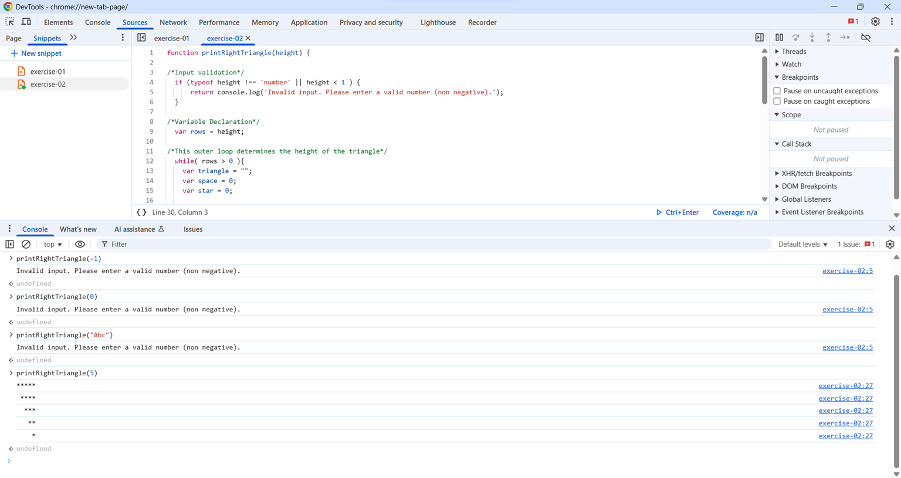
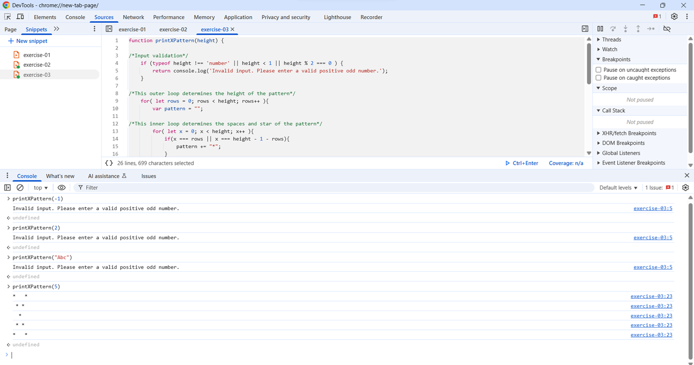
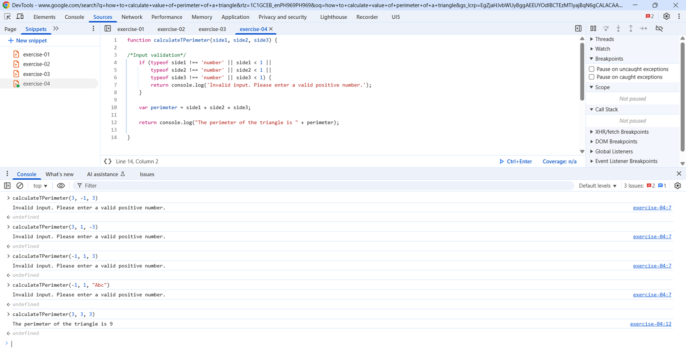
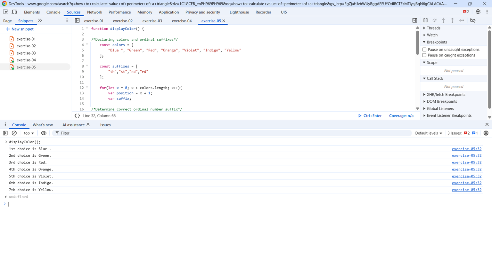

# sapui5bootcamp-activity03
JavaScript Activity

## Exercise 1
Code:  https://github.com/eejemanipon-bootcamp/sapui5bootcamp-activity03/blob/main/exercise-01.js
### Output  

## Exercise 2
Code:  https://github.com/eejemanipon-bootcamp/sapui5bootcamp-activity03/blob/main/exercise-02.js
### Output  

## Exercise 3
Code:  https://github.com/eejemanipon-bootcamp/sapui5bootcamp-activity03/blob/main/exercise-03.js
### Output  

## Exercise 4
Code:  https://github.com/eejemanipon-bootcamp/sapui5bootcamp-activity03/blob/main/exercise-04.js
### Output  

## Exercise 5
Code:  https://github.com/eejemanipon-bootcamp/sapui5bootcamp-activity03/blob/main/exercise-05.js
### Output  
